<div align="center">


<h1>Data Mesh Reference</h1>

<p><strong>The Institutional-Grade Platform for Standardized Data Mesh Foundations, Federated Governance, and Multi-Cloud Data Product Ecosystems.</strong></p>

[]()
[]()
[]()

<br/>

> **"Industrializing data mesh to automate domain-led foundations."** 
> **Data Mesh Reference** is an enterprise-grade platform designed to provide a secure, measurable, and highly automated foundation for global decentralized data operations. It orchestrates the complex lifecycle of data products—from domain discovery and automated marketplace publication to high-throughput sharing and unified federated auditing.

</div>

---

## 🏛️ Executive Summary

Fragmented data ownership and centralized data monoliths are strategic operational liabilities; lack of decentralized data governance is a primary barrier to organizational engineering maturity. Organizations fail to achieve data agility not because of a lack of data, but because of fragmented ownership standards, lack of automated data product validation, and an inability to orchestrate mesh planes with operational precision.

This platform provides the **Data Product Intelligence Plane**. It implements a complete **Data-Mesh-Reference-as-Code Framework**, enabling Data Leaders and Domain Architects to manage global decentralized foundations as first-class citizens. By automating the identification of data friction through real-time telemetry analysis and orchestrating the provisioning of secure performance-driven sharing policies, we ensure that every organizational domain—from Sales analytics to Finance squads—is supported by default, audited for history, and strictly aligned with institutional mesh frameworks.

---

## 📐 Architecture Storytelling: Principal Reference Models

### 1. Principal Architecture: Global Data Mesh & Data Product Intelligence Plane
This diagram illustrates the end-to-end flow from domain telemetry ingestion and multi-cloud orchestration to marketplace enforcement, performance validation, and institutional mesh auditing.

```mermaid
graph LR
    %% Subgraph Definitions
    subgraph DomainIngress["Domain & Source Ingress"]
        direction TB
        Sales["Sales Domain (SQL/CRM)"]
        Finance["Finance Domain (ERP/Oracle)"]
        HR["HR Domain (SaaS/Files)"]
    end

    subgraph IntelligenceEngine["Data Product Intelligence Hub"]
        direction TB
        API["FastAPI Mesh Gateway"]
        MeshOrchestrator["Global Domain & Product Hub"]
        Governance_Hub["Compliance & Guardrail Hub"]
        AIOps_Validator["Drift & Sharing Analysis Hub"]
    end

    subgraph OperationsPlane["Distributed Mesh Ecosystem"]
        direction TB
        ManagedProducts["Managed Standardized Data Products"]
        ActivePipelines["Managed Automated Sharing Pipelines"]
        MarketplaceSinks["Managed Infrastructure Marketplace Hubs"]
    end

    subgraph OperationsHub["Institutional Data Hub"]
        direction TB
        Scorecard["Mesh Maturity Scorecard"]
        Analytics["Mesh Flow & Sharing Velocity Stats"]
        Audit["Forensic Sharing Metadata Lake"]
    end

    subgraph DevOps["Data-Mesh-Reference-as-Code Framework"]
        direction TB
        TF["Terraform Mesh Modules"]
        DriftBot["Productivity & Config Drift Validator"]
        ChatOps["Measurement Operations Hub"]
    end

    %% Flow Arrows
    DomainIngress -->|1. Submit Metadata| API
    API -->|2. Orchestrate Mesh| MeshOrchestrator
    MeshOrchestrator -->|3. Apply Privacy Guard| Governance_Hub
    Governance_Hub -->|4. Assess Drift| AIOps_Validator
    
    AIOps_Validator -->|5. Execute Sharing| OperationsPlane
    OperationsPlane -->|6. Notify Status| ChatOps
    API -->|7. Visualize Health| Scorecard
    
    Scorecard -->|8. Track Maturity| Analytics
    Scorecard -->|9. Record Performance| Audit
    
    TF -->|10. Provision Backbone| IntelligenceEngine
    DriftBot -->|11. Inject Friction Risk| MeshOrchestrator
    Audit -->|12. Improve Operations| ManagedProducts

    %% Styling
    classDef ingress fill:#f5f5f5,stroke:#616161,stroke-width:2px;
    classDef intel fill:#e8eaf6,stroke:#1a237e,stroke-width:2px;
    classDef operations fill:#e1f5fe,stroke:#01579b,stroke-width:2px;
    classDef ops fill:#ede7f6,stroke:#311b92,stroke-width:2px;
    classDef devops fill:#e8f5e9,stroke:#1b5e20,stroke-width:2px;

    class DomainIngress ingress;
    class IntelligenceEngine intel;
    class OperationsPlane operations;
    class OperationsHub ops;
    class DevOps devops;
```

### 2. The Data Mesh Lifecycle Flow
The continuous path of a data mesh platform from initial integration (domain) and aggregation (product) to active analysis (contract), optimization (share), and institutional forensic auditing (scorecard).

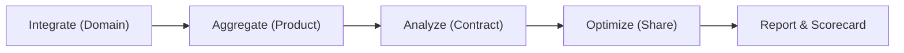

### 3. Distributed Mesh Telemetry Topology
Strategically orchestrating standardized data products across global domain hubs, diverse cloud architectures, and multi-cloud targets, providing a unified institutional view of global mesh health and operational readiness.

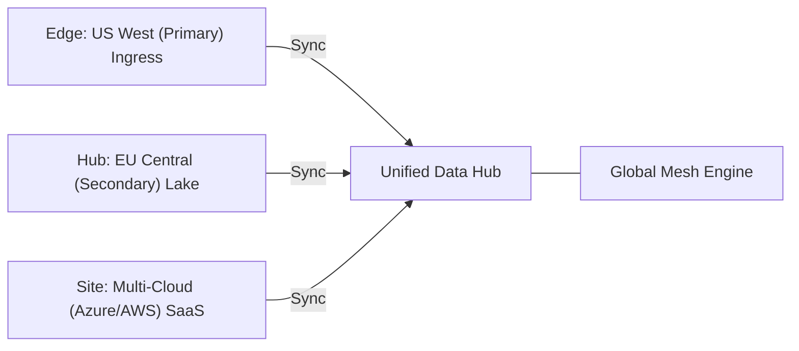

### 4. Mesh Governance & High-Trust Data Plane Protection Flow
Executing complex logic for securing the bridge between data producers and consumers, ensuring every organizational identity is verified, domain-level privacy is maintained, and every mesh access is according to institutional standards.

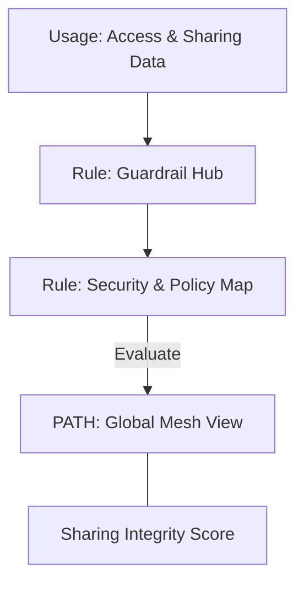

### 5. Multi-Cloud Mesh Federation & Governance Flow
Automatically managing unified mesh standards across global regions and diverse cloud tenants, ensuring institutional data residency and privacy boundaries by default.

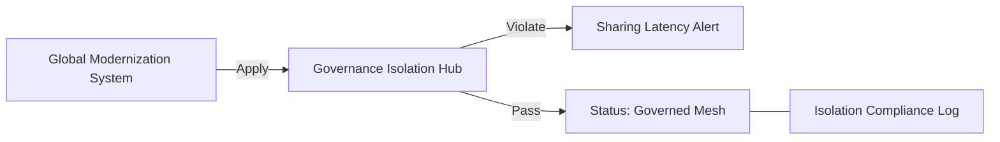

### 6. Encryption & Perimeter Protection Flow (Mesh Standard)
Managing the lifecycle of a sharing request, automatically enforcing institutional TLS 1.3 and resource encryption standards as required by security policy, ensuring zero-latency security confidence.

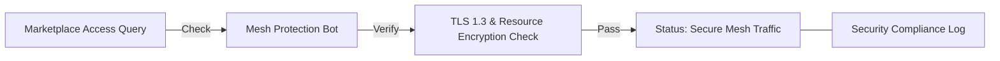

### 7. Institutional Mesh Maturity Scorecard
Grading organizational performance based on key indicators: Data Product Adoption Index, Domain Autonomy Index, and Contract Compliance Scores.

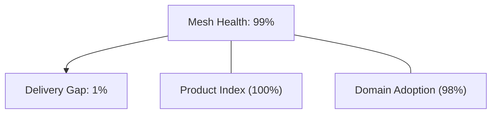

### 8. Identity & RBAC for Mesh Governance
Managing fine-grained access to mesh hubs, provisioning workers, and audit logs between CDOs, Domain Owners, and Data Consumers.

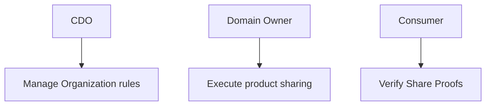

### 9. IaC Deployment: Data-Mesh-Reference-as-Code Framework
Using modular Terraform to deploy and manage the versioned distribution of the mesh tracking hubs, sharing protection workers, and forensic metadata lakes.

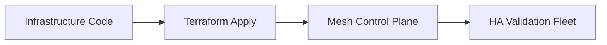

### 10. AIOps Mesh Drift & Risk Validation Flow
Using advanced analytics to identify sudden surges in sharing volume, unauthorized domain changes, suspicious configuration drifts, or unusual delivery pattern changes that could result in institutional risk or data corruption.

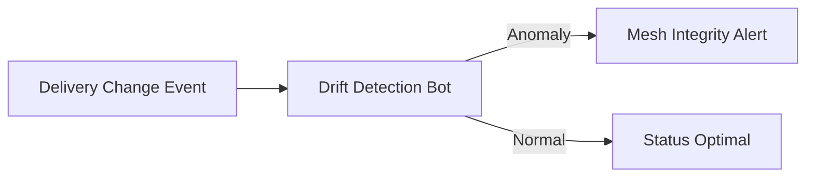

### 11. Metadata Lake for Forensic Mesh Audit
Storing long-term records of every domain integration event (metadata), every sharing executed, and every contract history for institutional record-keeping, compliance auditing, and post-provisioning forensics.

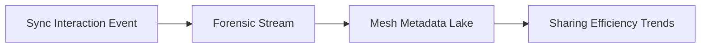

---

## 🏛️ Core Governance Pillars

1.  **Unified Foundation Coordination**: Maximizing agility by centralizing all decentralized measurement through a single institutional plane.
2.  **Automated Product Provisioning**: Eliminating "manual sharing" scenarios through proactive orchestration and pattern verification.
3.  **Sequential Mesh Intelligence**: Ensuring zero-interruption operations through dependency-aware sharing-driven data engineering.
4.  **Zero-Trust Identity Protection**: Automatically enforcing identity-based access, domain-level aggregation, and privacy evaluation across all sharing tiers.
5.  **Autonomous Operations Logic**: Guaranteeing reliability through automated industry-specific effectiveness monitoring runbooks.
6.  **Full Sharing Auditability**: Immutable recording of every contract change and mesh provision for institutional forensics.

---

## 🛠️ Technical Stack & Implementation

### Mesh Engine & APIs
*   **Framework**: Python 3.11+ / FastAPI.
*   **Performance Engine**: Custom Python-based logic for multi-toolchain domain ingestion and mesh metrics.
*   **Integrations**: Native connectors for Databricks, Snowflake, Fabric, and OpenLineage.
*   **Persistence**: PostgreSQL (Mesh Ledger) and Redis (Live Sharing State).
*   **Auth Orchestrator**: Federated OIDC/SAML for least-privilege mesh management access.

### Governance Dashboard (UI)
*   **Framework**: React 18 / Vite.
*   **Theme**: Dark, Slate, Indigo (Modern high-fidelity productivity aesthetic).
*   **Visualization**: D3.js for delivery topologies and Recharts for readiness velocity analytics.

### Infrastructure & DevOps
*   **Runtime**: AWS EKS or Azure Kubernetes Service (AKS) for management plane.
*   **Measurement Hub**: Managed event sourcing for immutable productivity timeline reconstruction.
*   **IaC**: Modular Terraform for deploying the mesh landing zone and validation fleet.

---

## 🏗️ IaC Mapping (Module Structure)

| Module | Purpose | Real Services |
| :--- | :--- | :--- |
| **`infrastructure/mesh_hub`** | Central management plane | EKS, PostgreSQL, Redis |
| **`infrastructure/enforcers`** | Distributed mesh provisioners | Azure, AWS, GCP APIs |
| **`infrastructure/sharing_pipes`** | Data Ingestion Hubs | Webhooks, Lambda |
| **`infrastructure/auditing`** | Forensic modernization sinks | S3, Athena, Quicksight |

---

## 🚀 Deployment Guide

### Local Principal Environment
```bash
# Clone the Data Mesh Reference repository
git clone https://github.com/devopstrio/data-mesh-reference.git
cd data-mesh-reference

# Configure environment
cp .env.example .env

# Launch the Mesh stack
make init

# Trigger a mock domain update and automated guardrail validation simulation
make simulate-mesh
```

Access the Management Portal at `http://localhost:3000`.

---

## 📜 License
Distributed under the MIT License. See `LICENSE` for more information.

---
<div align="center">
  <p>© 2026 Devopstrio. All rights reserved.</p>
</div>
