<div align="center">


<h1>Data Mesh Reference</h1>

<p><strong>The Strategic Blueprint for Decentralized Data Excellence, Domain Ownership, and Federated Governance at Industrial Scale</strong></p>

[]()
[]()
[]()
[]()

<br/>

> **"Shifting from data as a byproduct to data as a product."** 
> Data Mesh Reference is a flagship platform designed to provide production-ready blueprints for building a decentralized data architecture across Azure, AWS, GCP, and hybrid estates.

</div>

---

## 🏛️ Executive Summary

**Data Mesh Reference** is a flagship architectural hub designed for Chief Data Officers (CDOs), Enterprise Architects, and Domain Leaders. In the era of massive data scale and organizational complexity, traditional centralized data lakes have become the bottlenecks of innovation. 

This platform provides a complete **Data Mesh Operating Model**, demonstrating how to decentralize data ownership to the domains (Sales, Finance, HR) while maintaining a **Federated Governance** model. It delivers ready-to-use **Infrastructure as Code (Terraform)**, **Data Product Templates**, **Contract-First Interoperability**, and high-fidelity dashboards for measuring mesh maturity, product quality, and domain accountability.

---

## 💡 Why Data Mesh Matters

The centralized "Data Lake Monolith" fails at scale due to:
- **Lack of Domain Context**: Central teams don't understand the nuances of source systems.
- **Scaling Bottlenecks**: Every new data request must go through a single overloaded team.
- **Poor Accountability**: "Throwing data over the fence" leads to low quality and lack of trust.
- **Inflexible Governance**: One-size-fits-all policies stifle domain-specific innovation.

---

## 🚀 Business Outcomes

### 🎯 Strategic Mesh Impact
- **80% Reduction in Data Friction**: Domains build and serve their own data products independently.
- **Industrialized Data Quality**: Ownership at the source ensures data is "Certified" and trusted.
- **Universal Discoverability**: A global marketplace for data products across the entire enterprise.
- **Federated Compliance**: Global policies (Privacy, Security) enforced automatically via the platform.

---

## 🏗️ Technical Stack

| Layer | Technology | Rationale |
|---|---|---|
| **Data Platform** | Databricks, Snowflake, Fabric | Multi-engine support for diverse domain needs. |
| **Orchestration** | Airflow / Spark / dbt | Industrial-grade data processing and transformation. |
| **Streaming** | Kafka / Event Mesh | Real-time cross-domain data exchange. |
| **Backend** | FastAPI | High-performance API for the mesh control plane. |
| **Frontend** | React 18, Vite | Premium portal for the Data Product Marketplace. |
| **Infrastructure** | Terraform | Multi-cloud IaC for domain-specific foundations. |

---

## 📐 Architecture Storytelling: 60+ Diagrams

### 1. Executive High-Level Mesh Architecture
The holistic vision of the decentralized enterprise data mesh.

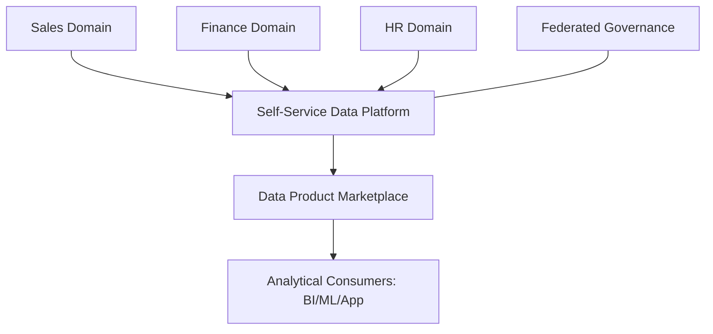

### 2. Detailed Component Topology
The internal service boundaries and secure data movement paths.

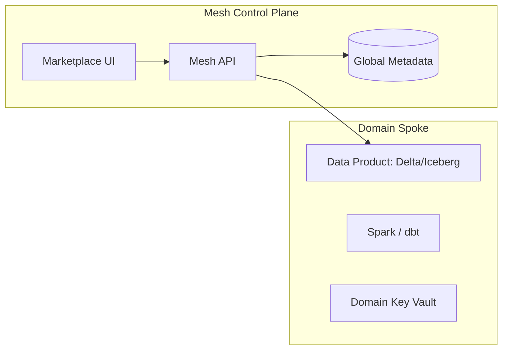

### 3. Frontend to Backend Request Path
Tracing a request to "Purchase/Access a Data Product" through the mesh.

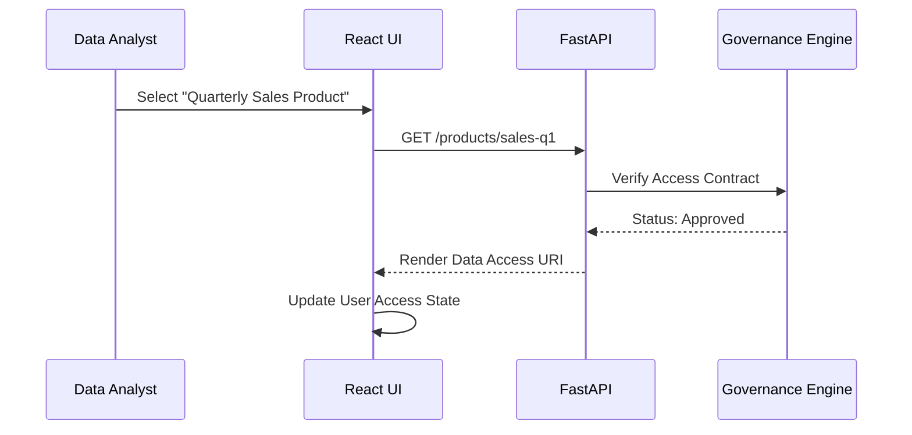

### 4. Self-Service Platform Control Plane
Empowering domains to provision their own data infrastructure.

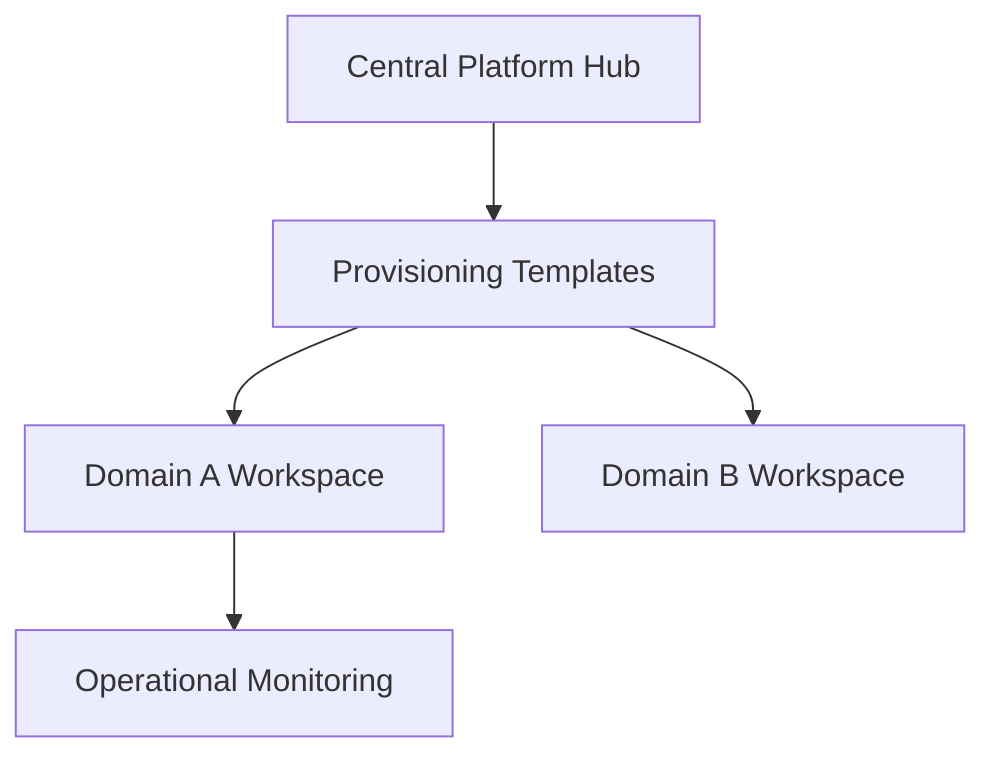

### 5. Multi-Cloud Mesh Topology
Synchronizing data products across major cloud providers.

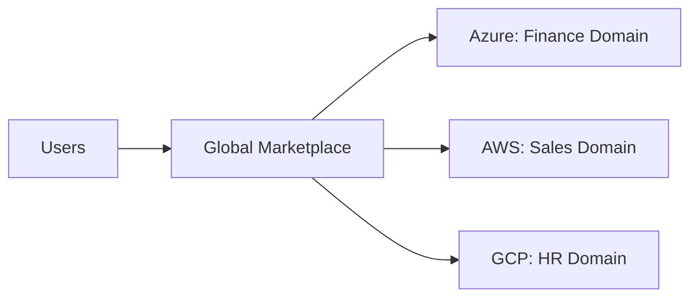

### 6. Regional Deployment Model
Hosting domain-specific data products for sovereignty and performance.

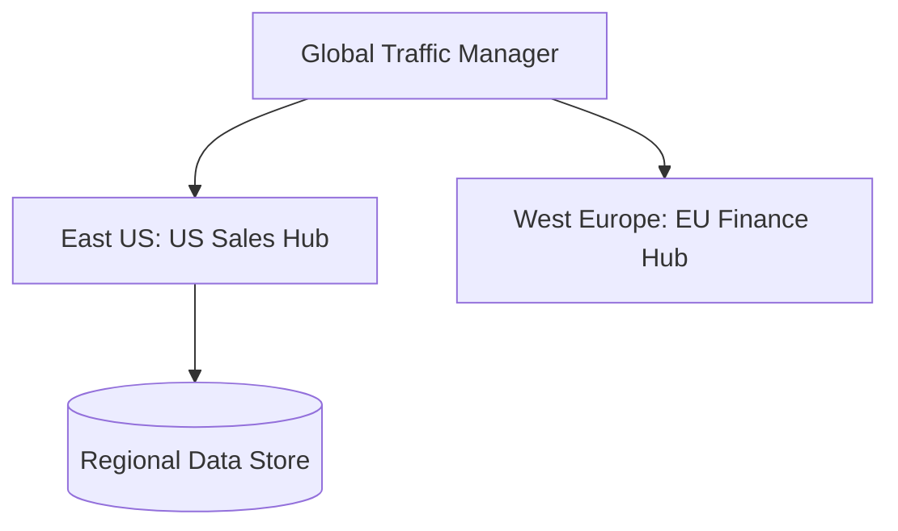

### 7. DR Failover Model
Continuous analytics availability during regional cloud outages.

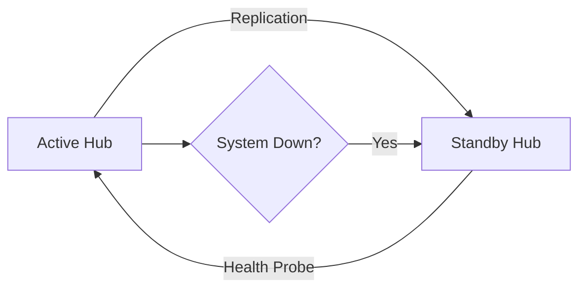

### 8. API Gateway Architecture
Securing and throttling the entry point for mesh discovery.

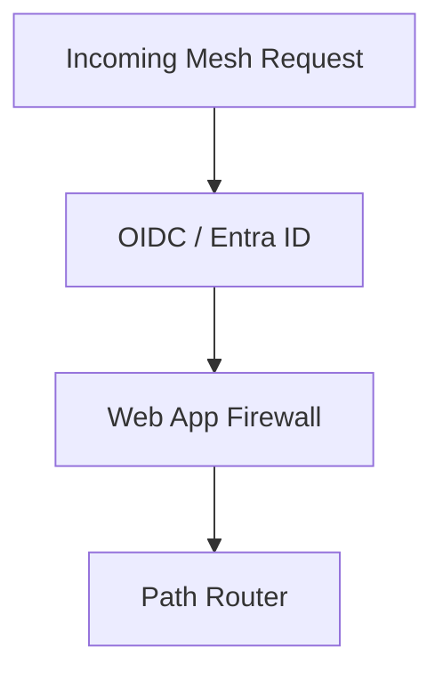

### 9. Queue Worker Architecture
Managing background metadata sync and product quality scoring.

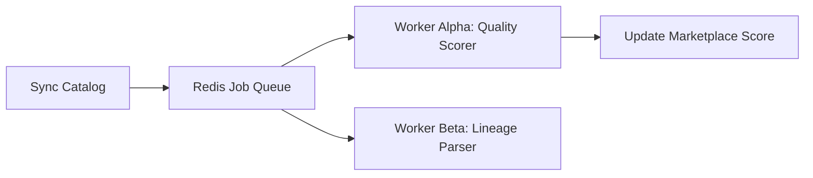

### 10. Dashboard Analytics Flow
How raw domain signals become executive mesh scorecards.

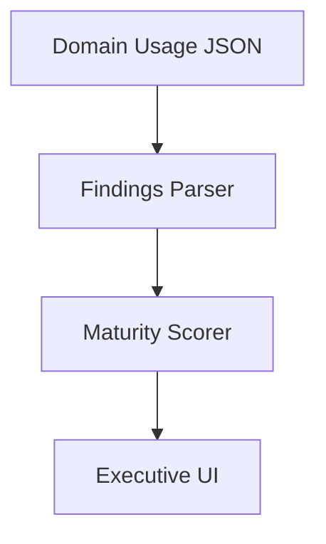

### 11. Domain Ownership Model
Accountability at the source of data creation.

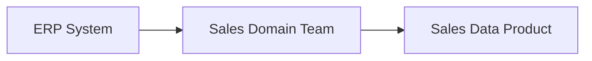

### 12. Sales Domain Data Products
Specific analytical assets for the sales domain.

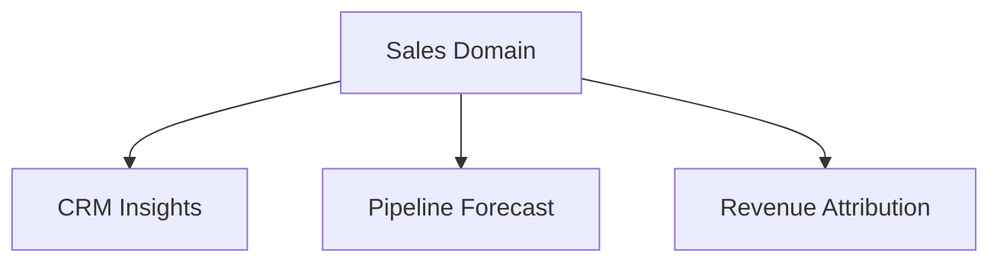

### 13. Finance Domain Data Products
Critical financial reporting and audit products.

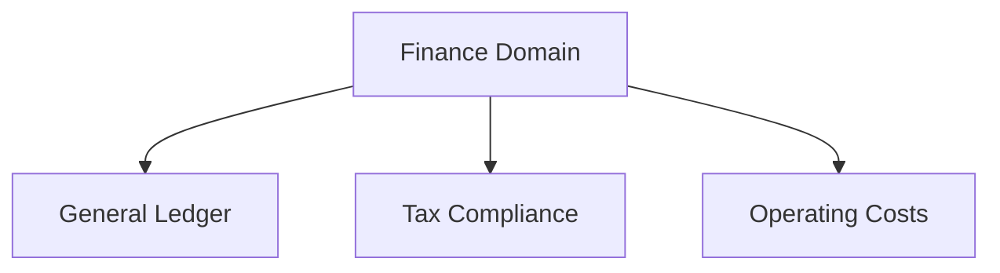

### 14. Supply Chain Domain Model
Tracking movement and inventory as data products.

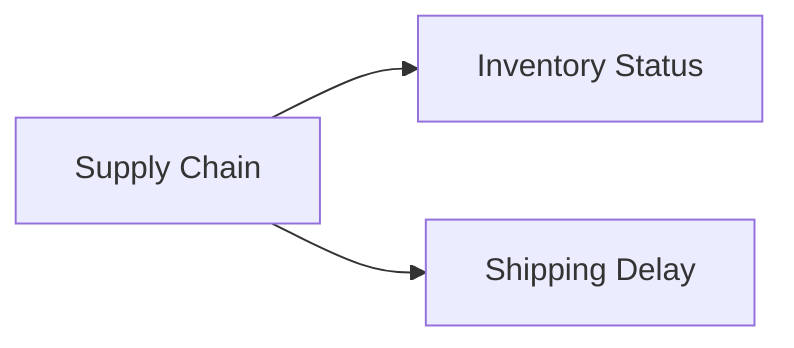

### 15. HR Domain Model
Employee lifecycle and talent analytics.

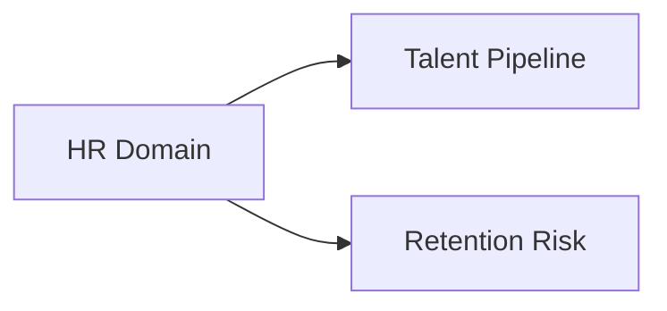

### 16. Federated Governance Council
Strategic alignment across domain leads and platform engineers.

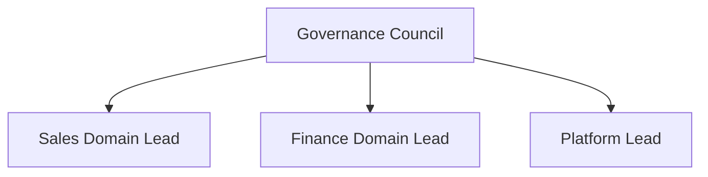

### 17. Data Product Lifecycle
The journey from ideation to decommissioning.

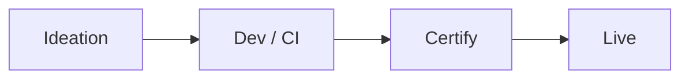

### 18. Product SLA Workflow
Guaranteeing uptime and freshness for consumers.

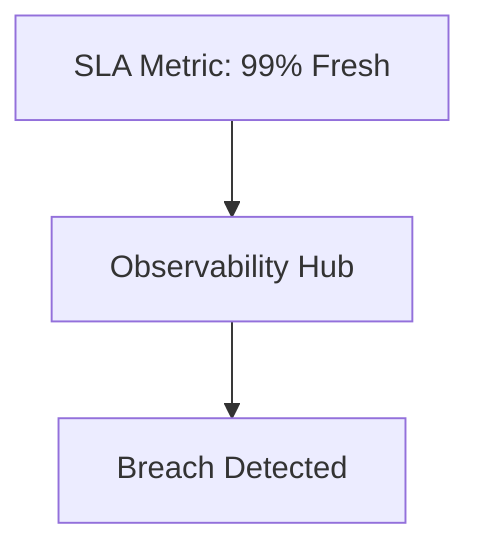

### 19. Product Certification Flow
Validating security and quality before publication.

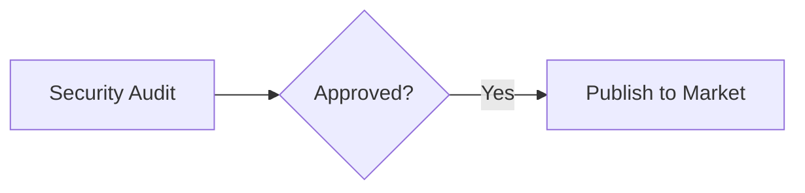

### 20. Cross-Domain Consumption Model
How one domain consumes a product from another.

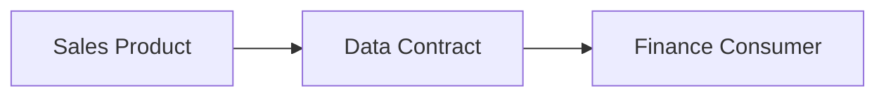

### 21. Data Contract Lifecycle
Managing the agreement between producer and consumer.

```mermaid
graph TD
    Draft[Draft Contract] --> Review[Consumer Review]
    Review --> Live[Active Binding]
```

### 22. Schema Versioning Workflow
Ensuring backward compatibility for data products.

```mermaid
graph LR
    v1[v1.0.0] --> v1_1[v1.1.0: Compatible]
    v1_1 --> v2[v2.0.0: Breaking]
```

### 23. API-First Data Sharing Model
Providing programmatic access to analytical assets.

```mermaid
graph LR
    User[App Developer] --> API[Product API]
    API --> Store[(Gold Layer)]
```

### 24. Event Topic Ownership Flow
Decentralized management of real-time event streams.

```mermaid
graph TD
    Sales[Sales Domain] --> Topic[Order-Placed-Topic]
    Topic --> Subscriber[Shipping Consumer]
```

### 25. CDC to Product Pipeline
Low-latency ingestion from operational databases.

```mermaid
graph LR
    DB[PostgreSQL] --> CDC[Debezium]
    CDC --> Product[Silver/Gold Delta]
```

### 26. Batch Product Publishing
Scheduled refresh of analytical data products.

```mermaid
graph TD
    Sched[Airflow Trigger] --> Job[Spark Batch]
    Job --> Gold[Update Gold Layer]
```

### 27. Discoverability Catalog Workflow
Synchronizing local products with the global catalog.

```mermaid
graph LR
    Local[Domain Catalog] --> Sync[Sync Agent]
    Sync --> Global[Enterprise Marketplace]
```

### 28. Product Deprecation Lifecycle
Sunsetting old data products gracefully.

```mermaid
graph TD
    Notify[Notify Consumers] --> Sunset[Mark as Deprecated]
    Sunset --> Remove[Final Deletion]
```

### 29. Quality Score Workflow
Quantifying data trustworthiness for consumers.

```mermaid
graph LR
    DQ[DQ Test] --> Score[Quality Score: 98.4]
    Score --> Marketplace[Badge in UI]
```

### 30. Consumer Feedback Loop
Rating and reviewing data products.

```mermaid
graph TD
    Consumer[User] --> Rate[5 Star Rating]
    Rate --> Producer[Domain Lead Feedback]
```

### 31. Domain CI/CD Workflow
Standardized release pipelines for data products.

```mermaid
graph LR
    Commit[Git Commit] --> Test[DQ/Unit Test]
    Test --> Deploy[Deploy to Spoke]
```

### 32. Template Provisioning Model
Reducing domain friction via blueprints.

```mermaid
graph TD
    Blueprint[Databricks Blueprint] --> Instance[New Workspace]
```

### 33. Namespace Isolation Architecture
Secure logical separation within shared compute.

```mermaid
graph LR
    Cluster[Kubernetes / Spark] --> NS_Fin[Finance Namespace]
    Cluster --> NS_Sales[Sales Namespace]
```

### 34. Cost Chargeback by Domain
Granular financial accountability.

```mermaid
graph TD
    Bill[Cloud Bill] --> Tags[Domain Tags]
    Tags --> Invoice[Domain Chargeback]
```

### 35. Multi-tenant Compute Model
Optimizing resource usage across domains.

```mermaid
graph LR
    Request[Job Request] --> Scheduler[Resource Fair Share]
```

### 36. Lakehouse Product Storage Pattern
Unified storage for analytical assets.

```mermaid
graph TD
    Storage[(ADLS / S3)] --> Delta[Delta Lake Format]
    Delta --> Unity[Unity Catalog]
```

### 37. Streaming Platform Architecture
Real-time backbone for the event mesh.

```mermaid
graph LR
    Sales_Topic[Sales] --> Kafka[Kafka Cluster]
    Kafka --> HR_Topic[HR]
```

### 38. dbt Transformation Workflow
Modular modeling for domain data products.

```mermaid
graph TD
    Stg[Staging] --> Int[Intermediate]
    Int --> Prod[Product View]
```

### 39. Notebook Collaboration Flow
Collaborative data science within domains.

```mermaid
graph LR
    Scientist[User] --> NB[Databricks Notebook]
    NB --> Git[Version Control]
```

### 40. ML Feature Sharing Model
Reusing features across the mesh.

```mermaid
graph TD
    Sales_Model[Sales ML] --> Store[Feature Store]
    Store --> Finance_Model[Finance ML]
```

### 41. OIDC / SSO Auth Flow
Securing the marketplace.

```mermaid
sequenceDiagram
    User->>Portal: Login
    Portal->>AzureAD: Auth
    AzureAD-->>User: Token
```

### 42. RBAC / ABAC Model
Zero-trust data access control.

```mermaid
graph TD
    User[User] --> Role[Finance Analyst]
    Role --> Data[Restricted Financials]
```

### 43. Secrets Management Flow
Securing domain-specific credentials.

```mermaid
graph LR
    Job[Spark Job] --> KV[Domain Key Vault]
```

### 44. Audit Logging Architecture
Immutable records for compliance.

```mermaid
graph TD
    Action[Query] --> Store[(Audit Bucket)]
```

### 45. Data Lineage Workflow
Visualizing the cross-domain journey.

```mermaid
graph LR
    S_CRM[Sales CRM] --> S_Rev[Sales Revenue]
    S_Rev --> F_ARR[Finance ARR]
```

### 46. Privacy Classification Lifecycle
Automated PII detection.

```mermaid
graph TD
    Scan[PII Scan] --> Tag[Apply Label]
```

### 47. Retention Governance Flow
Enforcing data deletion rules.

```mermaid
graph LR
    Policy[7 Year Rule] --> Purge[Automated Deletion]
```

### 48. Access Request Workflow
Governing the request for data products.

```mermaid
graph TD
    Req[Access Req] --> Owner[Domain Approval]
    Owner --> Provision[Grant Permission]
```

### 49. Policy-as-Code Lifecycle
Continuous foundation compliance.

```mermaid
graph LR
    Rule[No Public S3] --> Check[GHA Check]
```

### 50. Risk Review Workflow
Assessing domain security posture.

```mermaid
graph TD
    Scan[Vulnerability Scan] --> Review[Security Team]
```

### 51. Metrics Pipeline
Real-time mesh health monitoring.

```mermaid
graph LR
    Logs[Logs] --> Prom[Prometheus]
    Prom --> Grafana[Mesh Dashboard]
```

### 52. Logging Architecture
Centralized observability.

```mermaid
graph TD
    Sales[Sales Node] --> Loki[Loki]
    Finance[Finance Node] --> Loki
```

### 53. Tracing Model
Tracing cross-domain data requests.

```mermaid
sequenceDiagram
    Portal->>Product_A: Fetch Data
    Product_A->>Product_B: Check Lineage
```

### 54. SLA Monitoring Flow
Visualizing domain-to-domain reliability.

```mermaid
graph LR
    Perf[Latency] --> Alert[SLA Breach]
```

### 55. Release Pipeline Workflow
Standardized deployment for the mesh platform.

```mermaid
graph LR
    Push[Push] --> GHA[Actions]
    GHA --> AKS[Deploy]
```

### 56. Executive KPI Review Cycle
Measuring ROI and mesh maturity.

```mermaid
graph TD
    Stats[Metrics] --> Meeting[Quarterly Review]
```

### 57. Domain Maturity Scorecard
Benchmarking domain-level data excellence.

```mermaid
graph LR
    Dom[Domain A] --> Score[Maturity: Level 4]
```

### 58. Funding Model Workflow
Allocating budget for platform and domain teams.

```mermaid
graph TD
    Value[Business Value] --> Funding[Team Budget]
```

### 59. Adoption Roadmap Phases
The multi-year journey to a full mesh.

```mermaid
graph LR
    Pilot[Phase 1: Pilot] --> Scale[Phase 2: Scale]
```

### 60. Enterprise Operating Cadence
Aligning domain teams with business goals.

```mermaid
graph TD
    Annual[Annual Goals] --> Monthly[Domain Review]
```

---

## 🔬 Data Mesh Education & Methodology

### 1. The Four Pillars of Data Mesh
- **Domain-oriented Decentralized Data Ownership and Architecture**: Moving responsibility to those who know the data best.
- **Data as a Product**: Thinking about analytical assets as products with users and SLAs.
- **Self-serve Data Infrastructure as a Platform**: Providing the tools for domains to succeed independently.
- **Federated Computational Governance**: Implementing global standards while allowing domain-level flexibility.

### 2. Data Product vs Data Asset
A **Data Product** in our mesh is not just a table; it is a self-contained unit consisting of:
- **Data**: The actual bits (Delta Lake, Iceberg).
- **Metadata**: Definitions, owners, and freshness.
- **Code**: The pipelines and transformation logic.
- **Infrastructure**: The compute and storage it runs on.
- **Policy**: Access control and sharing contracts.

---

## 🚦 Getting Started

### 1. Prerequisites
- **Terraform** (v1.5+).
- **Docker Desktop**.
- **Azure/AWS/GCP CLI** configured.

### 2. Local Setup
```bash
# Clone the repository
git clone https://github.com/Devopstrio/data-mesh-reference.git
cd data-mesh-reference

# Start the Mesh Control Plane
docker-compose up --build
```
Access the Data Marketplace at `http://localhost:3000`.

---

## 🛡️ Governance & Security
- **Federated Compliance**: Global policies for data privacy and security are defined by the central governance council but enforced locally within each domain's infrastructure.
- **Zero-Trust Access**: All cross-domain data sharing is governed by explicit **Data Contracts** and just-in-time access provisioning.
- **Immutable Auditability**: Every access request and product modification is recorded in a centralized, immutable audit log.

---
<sub>&copy; 2026 Devopstrio &mdash; Engineering the Future of Decentralized Intelligence.</sub>
